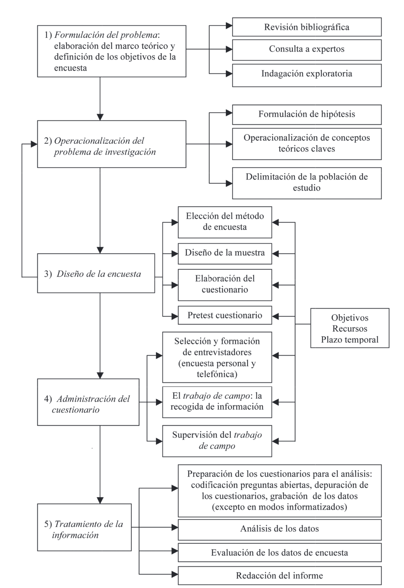

# Diseño del cuestionario y escalas de medición

```markdown
---
Fecha: 2026-03-10
Modulo: 3
Sesión: 12
---
```

Esta sesión tuvo dos partes. La primera fue el examen del Módulo 3. La segunda estuvo dedicada al entender mejor cómo avanzamos en el diseño del instrumento, es decir, cómo construir un buen cuestionario y qué opciones tenemos para incluir las escalas de medición en un cuestionario. 

## Fases esenciales de la encuesta

Antes de entrar al cuestionario, repasamos brevemente cuáles son las fases esenciales de la encuesta como proceso. La operacionalización (2) se articula de forma iterativa con el diseño del cuestionario (3).  Así, las fases nos sirven para organizar nuestro propio trabajo, entendiendo qué debemos resolver en cada momento del proceso. Las decisiones y la articulación dentre los momentos o fases, determina directamente la calidad de los datos que vamos a obtener y las posibilidades de analizar la realidad social que estos nos otorgen.  



## Elaboración de un cuestionario

Diseñar un cuestionario no es solo redactar preguntas. Implica tomar decisiones sobre qué medir, cómo medirlo y cómo formularlo para minimizar errores. En clase mencionamos cuatro tipos de error que conviene evitar al momento de preparar nuestras preguntas y nuestro cuestionario:

- **Especificación**: la pregunta no se adecua a los objetivos o no se corresponde con el concepto que se quiere medir.
- **Medición por vocabulario**: el uso de palabras ambiguas o con distintas connotaciones genera una interpretación desigual de los términos.
- **Medición por redacción**: el error surge de cómo es introducida o formulada la pregunta.
- **Medición por opciones de respuesta**: las respuestas se ven afectadas por el orden en que se presentan las alternativas, o porque estas están desequilibradas o inducen una respuesta en particular.

Varios de estos errores de medición pueden reducirse con un buen diseño de cuestionario. Para lograrlo, Cea D'Ancona propone cuatro pasos:

**a)** Especificar los objetivos de la encuesta y la información que pretende recogerse.

**b)** Identificar los conceptos centrales en la investigación y traducirlos en indicadores válidos, que ayuden a reducir los errores de especificación. Esto implica diferenciar lo que el concepto incluye y excluye; describir su opuesto (tolerancia e intolerancia, xenofobia y xenofilia, discriminación e integración); descomponer el concepto en dimensiones y buscar indicadores para cada una. En general, es preferible acotar dimensiones y aumentar indicadores, ya que esto aumenta la validez de constructo.

**c)** Elegir el método de encuesta y concretar la población. Como regla general: utilizar palabras comprendidas por aquellos de menor nivel de formación en la población de estudio.

**d)** Concretar los análisis que se prevé realizar, en consonancia con los objetivos de la investigación.

## La redacción de las preguntas

Una buena pregunta es aquella que no afecta a la respuesta (Payne, 1980: 72). Sin embargo, como señala Hox (1997: 53), no existe ninguna pregunta de encuesta puramente objetiva. La búsqueda de la objetividad se convierte entonces en una **meta**: es un requisito de calidad de la pregunta, pero siempre hay limitaciones. Lo que buscamos es **optimizar** la formulación siguiendo buenas prácticas y recomendaciones.

Algunas de las recomendaciones más importantes para redactar preguntas son:

- Formular preguntas **relevantes** para la investigación.
- Que sean **breves** y fáciles de comprender por las personas a las que van dirigidas.
- Usar vocabulario **sencillo**, evitando conceptos o términos abstractos (por ejemplo, "dolor de cabeza" en lugar de "cefaleas").
- Redacción **precisa**: cuantos más detalles aporte, más facilita su comprensión e interpretación.
- Lo más **objetiva o neutra** posible para no influir en la respuesta.
- **Sin negaciones**: dificultan la comprensión, especialmente cuando se pide un grado de acuerdo o desacuerdo (por ejemplo, ¿No le parece que...?).
- De forma **personal y directa**: las preguntas específicas dan información más precisa que las genéricas.
- **Principio de la idea única**: ni las preguntas ni las alternativas pueden referirse a varias cuestiones al mismo tiempo.
- Sin palabras que comporten una **reacción estereotipada**.

Fowler (1998) advierte además que no conviene utilizar escalas con adjetivos para medir estados subjetivos en estudios internacionales o con poblaciones de culturas diversas.

## El formato de la pregunta

Las preguntas pueden presentarse en el cuestionario con un formato **abierto** o **cerrado**, dependiendo de si aparecen expresas las alternativas de respuesta.

Las **preguntas abiertas** permiten que el encuestado se exprese con sus propias palabras, sin circunscribir su respuesta a una alternativa predeterminada. Tienen varias ventajas: son más fáciles de elaborar, ocupan menos espacio en el cuestionario, permiten obtener respuestas no previstas y captan lo más saliente para el encuestado. Sin embargo, también tienen inconvenientes importantes. Como señala Payne (1980: 53-54):

> "Pocas personas emplean las mismas palabras incluso para expresar la misma idea. Algunos clarifican sus afirmaciones mejor que otros. Esto hace la grabación difícil cuando queremos distinguir entre dos ideas estrechamente relacionadas pero aun así diferentes."

Además, son más caras en términos de registro, transcripción y codificación; más expuestas a errores de interpretación; y exigen más tiempo y esfuerzo por parte del encuestado. Por esto, su uso se desaconseja en cuestionarios autoadministrados (Dillman, 1978).

## ¿Qué es una escala?

Una escala dispone las respuestas u observaciones en un continuo, permitiendo captar la intensidad, la dirección y el nivel del constructo que se mide. Puede utilizar un único o varios items o indicadores, aunque lo habitual es que agrupe **múltiples indicadores** en un nivel de medición **ordinal**. Una escala raramente mide un constructo con una sola pregunta. Lo habitual es que combine varias (múltiples ítems o indicadores) que juntos capturan distintos aspectos del mismo constructo.

En clase vimos cinco tipos de escala:

1. Escala de **distancia social** de Bogardus (proximidad)
2. Escala **diferencial** de Thurstone (posición en un continuo)
3. Escala **acumulativa** de Guttman (acumulación)
4. Escala **aditiva** de Likert (intensidad de acuerdos)
5. Diferencial **semántico** de Osgood (percepción)

### Escala de distancia social de Bogardus

Se usa para medir la voluntad de miembros de grupos étnicos diferentes de relacionarse con otros (lo que se llama "distancia social"), o más en general, lo próximo o distante que una persona se siente de cualquier otro grupo de población (de diferente etnia, cultura, religión, personas privadas de libertad, etc.). Como señala Cea D'Ancona (2012, p. 93):

> "Una serie de proposiciones se ponen en orden decreciente, de mayor a menor deseo de interrelación con un grupo de población diferencial, expuesto a estigmas y prejuicios sociales."

Es una escala acumulativa: el acuerdo con un ítem implica el acuerdo con los ítems precedentes. Además, soporta un índice de distancia social en base al peso de cada punto de la escala. Pueden ver más al respecto en Cea D'Ancona (2012, pp. 93-95).

Un ejemplo ilustrativo de su estructura (en orden decreciente de proximidad social):

| Proposición | Sí | No |
|---|---|---|
| Admitiría a un miembro de este grupo como familiar cercano | 1 | 0 |
| Lo admitiría como amigo personal | 1 | 0 |
| Lo admitiría como vecino en mi barrio | 1 | 0 |
| Lo admitiría como compañero de trabajo | 1 | 0 |
| Lo admitiría como ciudadano de mi país | 1 | 0 |
| Solo lo admitiría como turista | 1 | 0 |
| Lo excluiría de mi país | 1 | 0 |

### Escala diferencial de Thurstone

Es un procedimiento para medir actitudes mediante aseveraciones evaluadas por jueces. La escala incluye una serie de proposiciones (favorables o contrarias) relativas a una determinada actitud, expresadas de manera categórica. De cada una se pide que se indique si se está de acuerdo o en desacuerdo. El promedio de las respuestas resume la actitud hacia el objeto de estudio. Únicamente mide el acuerdo o el desacuerdo, **no la intensidad** del acuerdo y el desacuerdo. La laboriosidad que exige su elaboración explica su uso limitado en la investigación social.

Los pasos para construirla son: determinar la actitud a medir; generar un número elevado de ítems (de 100 a 150) que cubran el continuo de la actitud desde el extremo más positivo hasta el más negativo; someter esos ítems a una **prueba de jueces** (preferiblemente 30 o más), quienes los clasifican en uno de 11 montones del continuo (de "bastante desfavorable" a "bastante favorable", siendo el 6 el valor neutro); y finalmente seleccionar y listar de forma aleatoria los 20 o 30 ítems definitivos. Pueden ver más en Cea D'Ancona (2012, pp. 96-98).

Un ejemplo de esta escala es la _Escala de actitudes raciales_ (Srole, en García Ferrando, 1971):

| Valor escalar | Ítem | Respuesta |
|---|---|---|
| 10,3 | Creo que el negro tiene los mismos derechos sociales que el blanco | De acuerdo / En desacuerdo |
| 7,7 | El negro es perfectamente capaz de cuidar de sí mismo, si el hombre blanco le deja tranquilo | De acuerdo / En desacuerdo |
| 5,4 | No me interesa en absoluto la situación social del negro | De acuerdo / En desacuerdo |
| 2,7 | En ningún caso los niños negros deberían asistir a la misma escuela que los niños blancos | De acuerdo / En desacuerdo |
| 0,9 | El negro debería ocupar el lugar más bajo entre los seres humanos | De acuerdo / En desacuerdo |

El valor escalar resulta del promedio de los jueces evaluando cada ítem (donde 1 es "bastante desfavorable" y 11 es "bastante favorable"), por eso se usa para ordenar las actitudes.

### Escala acumulativa de Guttman

Es un procedimiento escalar acumulativo para medir actitudes en el que los ítems se ordenan de tal manera que la respuesta positiva a uno de ellos supone también acuerdo con los ítems de rango inferior. Se diferencia de Thurstone en que reduce los ítems (a 30 o más para seleccionar los definitivos) y elimina la prueba de jueces, reemplazándola por una **prueba piloto**. Las categorías de respuesta pueden ser dicotómicas ("de acuerdo" / "en desacuerdo") o politómicas (como en Likert, donde la puntuación más elevada se asigna al valor más favorable a la actitud). Ver Cea D'Ancona (2012, pp. 98-101).

La clave de esta escala es **validar** sus resultados identificando los errores en los valores. Si una persona responde afirmativamente a un ítem de cierta dificultad, debería responder también afirmativamente a todos los ítems de menor dificultad. Un **error** ocurre cuando esa cadena se rompe: la respuesta observada no coincide con la respuesta que el modelo predice para esa persona en ese ítem.

Vimos dos ejemplos. El primero fue una _Escala de aspiraciones de los padres hacia el logro educativo de sus hijos_. El segundo fue una escala de _dominio de técnicas e instrumentos de diagnóstico_ para estudiantes universitarios, que ayuda a diferenciar entre niveles de "principiante", "iniciado" y "experto" para la autoselección de actividades de aprendizaje.

### Escala aditiva de Likert

Viene de la psicología y mide actitudes. Propone menos ítems que Thurstone (alrededor de 60 para quedarse con 25). Las aseveraciones no deben ser "muy suaves" porque facilitan acuerdos y no permiten medir. Es una **escala politómica** (a diferencia de las dicotómicas): típicamente usa 5 opciones para facilitar a quien responde encontrar el matiz deseado, aunque puede tener entre 4 y 9 opciones (a más opciones, mayor fiabilidad en estudios longitudinales). Los números impares permiten un punto medio. La prueba se aplica a una muestra representativa.

Como señala Cea D'Ancona (2012, p. 102): "La información que aporten se utilizará para seleccionar los ítems finalmente a incluir en la escala definitiva: los menos ambiguos y más discriminantes para medir la actitud."

Para evaluar cada ítem, los sujetos se ordenan en orden decreciente según su puntuación total. Con el 25% de los sujetos con puntuaciones más elevadas (grupo alto) y el 25% con las más bajas (grupo bajo), se analiza la adecuación de cada ítem mediante tres criterios: la media en ambos grupos más la desviación típica (prueba t de Student); el coeficiente de correlación de cada ítem con el total (se eligen los que presenten correlación mayor a 0,35); y la mediana de cada ítem en ambos grupos (Cea D'Ancona, 2012, p. 104). Ver más en Cea D'Ancona (2012, pp. 102-109).

### Diferencial semántico de Osgood

Como señala Cea D'Ancona (2012, p. 109), este instrumento "muestra gran utilidad para la medición de estereotipos y, en general, de actitudes hacia diferentes grupos sociales." Los ítems son **pares de adjetivos** que expresan dimensiones del concepto a medir. Pueden ser bipolares (amigable y hostil) o unipolares (amigable y no amigable, que indican la existencia o ausencia de un único atributo). Los pares se alternan de forma **aleatoria** para que las respuestas positivas (o negativas) no caigan siempre en el mismo extremo. Ver Cea D'Ancona (2012, pp. 109-111).

## Puntos en común entre las escalas

Independientemente del tipo de escala, hay tres elementos que todas comparten: necesitamos **más ítems** de los que finalmente vamos a aplicar; necesitamos un **proceso de selección** (prueba) de los ítems; y debemos tener una **lógica general** que articule los ítems entre sí.

La siguiente tabla resume las diferencias y similitudes entre las cinco escalas vistas en clase:

| | Bogardus | Thurstone | Guttman | Likert | Osgood |
|---|---|---|---|---|---|
| **Lógica** | Acumulativa | Diferencial | Acumulativa | Aditiva | Semántica |
| **Qué mide** | Distancia social | Actitudes | Actitudes | Actitudes | Estereotipos y actitudes hacia grupos |
| **Nº de ítems** | — | 100-150 → 20-30 | ≥ 30 | ~60 → ~25 | 31 pares → selección final |
| **Prueba de ítems** | Pesos asignados por punto | Jueces (≥ 30) | Prueba piloto | Muestra representativa | Prueba piloto |
| **Tipo de respuesta** | Dicotómica | Dicotómica | Dicotómica o politómica | Politómica (4-9 opciones) | Escala 1-7 |
| **Tipo de ítem** | Proposiciones ordenadas | Aseveraciones | Proposiciones ordenadas | Aseveraciones | Pares de adjetivos bipolares |
| **Mide intensidad** | No | No | No | Sí | Sí |
